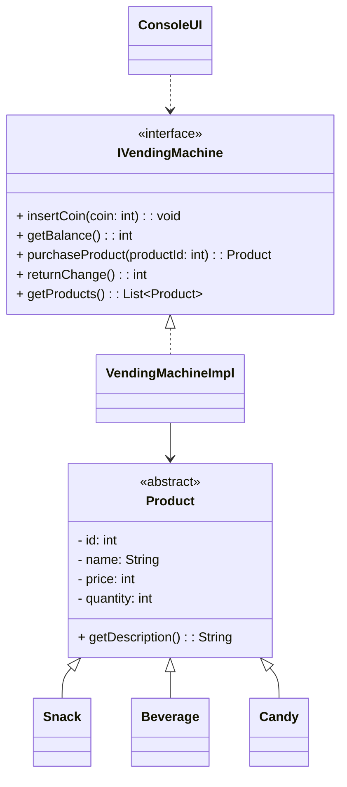

*** UML Class Diagram ***

# Vending Machine System
This project implements a vending machine system in Java. The system allows users to insert coins, view available products, purchase products, and receive change. The vending machine supports different types of products, including snacks, beverages, and candies.
## Features
- Insert coins and manage balance
- View available products with descriptions
- Purchase products and update inventory
- Return change to the user
- Console-based user interface for interaction
- Extensible design to add new product types easily
- Error handling for insufficient balance and out-of-stock products
- Unit tests to ensure functionality
- Documentation for classes and methods

## Getting Started
To run the vending machine system, follow these steps:
1. Clone the repository to your local machine.
2. Navigate to the project directory.
3. Compile the Java files using your preferred IDE or command line.
4. Run the `ConsoleUI` class to start the vending machine interface.
5. Follow the on-screen prompts to interact with the vending machine.
6. To run the unit tests, execute the test classes using your IDE or a build tool like Maven or Gradle.

